# SDDE-model

Python-wrapped SDDE solar dynamo model, originally based on Julia's
Stochastic Delay Differential Equation tooling.

## Install (editable)

```bash
pip install -e /Users/ulzg/SABC/SDDE-model
```

## Usage

```python
from sdde_model import init_julia, sn, sn_batch, summary_statistics

init_julia()

y = sn((1.0, 2.0, 3.0, 0.1, 5.0))
```

Call `init_julia()` before importing `tensorflow` or other native-library-heavy modules.
That early bootstrap reduces Julia/TensorFlow library conflicts and also forces
`juliacall` to use the pinned Julia project shipped with `sdde_model`.

If you skip the explicit call, `sdde_model` will still initialize Julia lazily on
first use, but the TensorFlow-safe import ordering is best when you call
`init_julia()` yourself near the top of the script.

## Startup Flow

```mermaid
flowchart LR
    A["Python script"] --> B["from sdde_model import init_julia"]
    B --> C["init_julia()"]
    C --> D["bootstrap.py"]
    D --> E["Set JULIA_PROJECT / PYTHON_JULIACALL_PROJECT"]
    E --> F["Use pinned Julia env in src/sdde_model/julia_env"]
    F --> G["Pkg.instantiate() if needed"]
    G --> H["Start juliacall / Julia"]
    H --> I["solar_dynamo.py loads Julia packages and functions"]
    I --> J["sn(), sn_batch(), summary_statistics(), ..."]
```



## What Happens Step By Step

1. Your Python script imports `init_julia()` from `sdde_model`.
2. `init_julia()` runs [`bootstrap.py`](/Users/ulzg/SABC/SDDE-model/src/sdde_model/bootstrap.py).
3. The bootstrap locates the package-local Julia environment in [`src/sdde_model/julia_env/Project.toml`](/Users/ulzg/SABC/SDDE-model/src/sdde_model/julia_env/Project.toml).
4. It points `juliacall` to that environment before Julia starts.
5. It runs `Pkg.instantiate()` so Julia installs the exact dependencies recorded in [`src/sdde_model/julia_env/Manifest.toml`](/Users/ulzg/SABC/SDDE-model/src/sdde_model/julia_env/Manifest.toml).
6. Only after that does Python start `juliacall`, so Julia comes up with the pinned project already active.
7. When you call `sn()`, `sn_batch()`, or `summary_statistics()`, [`solar_dynamo.py`](/Users/ulzg/SABC/SDDE-model/src/sdde_model/solar_dynamo.py) reuses that initialized Julia session and loads the required Julia packages.

## Why We Do It This Way

- It avoids TensorFlow/Julia native-library conflicts by starting Julia first.
- It avoids Julia package drift by pinning a known-good SciML environment.
- It lets you use `sdde_model` from other repositories without manually exporting `JULIA_PROJECT` in normal use.

## Recommended Pattern

```python
from sdde_model import init_julia
init_julia()

import tensorflow as tf
from sdde_model import sn, sn_batch
```

This explicit call is the safest pattern. Lazy initialization still works, but it is
less predictable if another library initializes native dependencies first.
