# SDDE-model

Python-wrapped SDDE solar dynamo model, originally based on Julia's
Stochastic Delay Differential Equation tooling.

## Install (editable)

Install `sdde_model` into the Python environment of the project that wants to use
this wrapped Julia model. Activate that environment first, then run:

```bash
conda activate my_project_env
pip install -e /Users/ulzg/SABC/SDDE-model
```

The `-e` means editable install, so changes in `/Users/ulzg/SABC/SDDE-model` are
immediately visible in that Python environment without reinstalling.

If you want the repo to declare its intended conda environment explicitly, you can
also create it from [environment.yml](/Users/ulzg/SABC/SDDE-model/environment.yml:1):

```bash
conda env create -f /Users/ulzg/SABC/SDDE-model/environment.yml
conda activate sddepy_env
```

## Usage

```python
from sdde_model import init_julia, sn, sn_batch, summary_statistics

init_julia()

y = sn((1.0, 2.0, 3.0, 0.1, 5.0))
```

Call `init_julia()` before importing `tensorflow` or other native-library-heavy modules.
That early bootstrap reduces Julia/TensorFlow library conflicts and also forces
`juliacall` to use the pinned Julia project shipped with `sdde_model`.

If you skip the explicit call, `sdde_model` will still initialize Julia lazily on
first use, but the TensorFlow-safe import ordering is best when you call
`init_julia()` yourself near the top of the script.

## Startup Flow

```mermaid
flowchart LR
    A["Python script"] --> B["from sdde_model import init_julia"]
    B --> C["init_julia()"]
    C --> D["bootstrap.py"]
    D --> E["Set JULIA_PROJECT / PYTHON_JULIACALL_PROJECT"]
    E --> F["Use pinned Julia env in src/sdde_model/julia_env"]
    F --> G["Pkg.instantiate() if needed"]
    G --> H["Start juliacall / Julia"]
    H --> I["solar_dynamo.py loads Julia packages and functions"]
    I --> J["sn(), sn_batch(), summary_statistics(), ..."]
```



## What Happens Step By Step

1. Your Python script imports `init_julia()` from `sdde_model`.
2. `init_julia()` runs [`bootstrap.py`](/Users/ulzg/SABC/SDDE-model/src/sdde_model/bootstrap.py).
3. The bootstrap locates the package-local Julia environment in [`src/sdde_model/julia_env/Project.toml`](/Users/ulzg/SABC/SDDE-model/src/sdde_model/julia_env/Project.toml).
4. It points `juliacall` to that environment before Julia starts.
5. It runs `Pkg.instantiate()` so Julia installs the exact dependencies recorded in [`src/sdde_model/julia_env/Manifest.toml`](/Users/ulzg/SABC/SDDE-model/src/sdde_model/julia_env/Manifest.toml).
6. Only after that does Python start `juliacall`, so Julia comes up with the pinned project already active.
7. When you call `sn()`, `sn_batch()`, or `summary_statistics()`, [`solar_dynamo.py`](/Users/ulzg/SABC/SDDE-model/src/sdde_model/solar_dynamo.py) reuses that initialized Julia session and loads the required Julia packages.

## Why We Do It This Way

- It avoids TensorFlow/Julia native-library conflicts by starting Julia first.
- It avoids Julia package drift by pinning a known-good SciML environment.
- It lets you use `sdde_model` from other repositories without manually exporting `JULIA_PROJECT` in normal use.

## Recommended Pattern

```python
from sdde_model import init_julia
init_julia()

import tensorflow as tf
from sdde_model import sn, sn_batch
```

This explicit call is the safest pattern. Lazy initialization still works, but it is
less predictable if another library initializes native dependencies first.

## Plotting From The Command Line

After installing the package, you can simulate one trajectory and plot `sn` with:

```bash
plot-sn \
  --tau 2.0 \
  --T 1.5 \
  --Nd 4.0 \
  --sigma 0.1 \
  --Bmax 5.0 \
  --T-warmup 200 \
  --T-obs 929 \
  --seed 123 \
  --dt 0.1 \
  --saveat 1.0
```

If you omit `--output`, `plot-sn` opens an interactive preview window and does not
save a PNG.

If you omit `--seed`, each run uses fresh randomness, so rerunning the same command
will generally produce a different trajectory.

If you pass `--nsim N`, `plot-sn` runs `N` stochastic simulations with the same
parameter set and overlays them on the same plot using different colors.

If you omit `--nsim`, the default is `1`.

If you use `--nsim` together with `--seed`, the runs use seeds `seed`, `seed+1`,
..., `seed+N-1` so the batch is reproducible while still producing different
trajectories.

For example, to compare five runs on the same figure:

```bash
plot-sn \
  --tau 2.0 \
  --T 1.5 \
  --Nd 4.0 \
  --sigma 0.1 \
  --Bmax 5.0 \
  --T-warmup 200 \
  --T-obs 929 \
  --nsim 5
```

To save the figure instead of opening a window:

```bash
plot-sn \
  --tau 2.0 \
  --T 1.5 \
  --Nd 4.0 \
  --sigma 0.1 \
  --Bmax 5.0 \
  --T-warmup 200 \
  --T-obs 929 \
  --output sn_plot.png
```

When `--output` is used, the saved PNG includes a parameter summary below the plot
so the figure records the settings that generated it.
